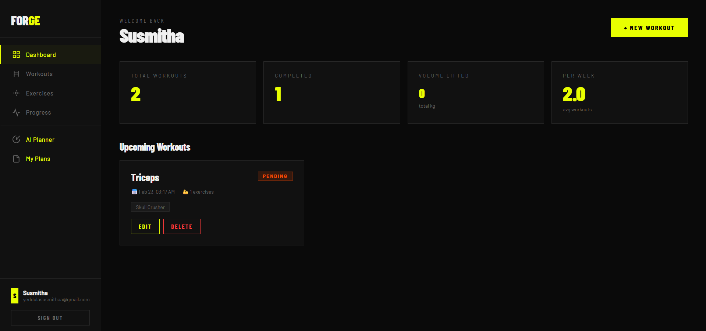

# 🏋️ FORGE — Workout Tracker

> **[🚀 Live Demo]: https://forge-bysush.vercel.app/



A full-featured workout tracking app built in Go with a beautiful dark web UI and AI-powered 7-day plan generator.

## Features

- **JWT Authentication** — Register, login, secure all endpoints
- **Exercise Library** — 40+ seeded exercises across strength, cardio, flexibility
- **Workout Management** — Create, update, delete, schedule workouts
- **Progress Reports** — Volume tracking, weekly trends, top exercises
- **AI Planner** — Generate personalised 7-day plans via Groq (Llama 3.3 70B)
- **My Plans** — Save and revisit AI-generated plans
- **Beautiful UI** — Dark, editorial-style single-page web interface
- **Unit Tests** — Full API test coverage
- **OpenAPI Docs** — Full spec in `docs/openapi.yaml`

---

## Step-by-Step Setup (Windows + VSCode)

### Step 1 — Install Go

1. Go to https://go.dev/dl/
2. Download the **Windows installer** (e.g. `go1.22.x.windows-amd64.msi`)
3. Run the installer — click Next through all defaults
4. Open a **new** Command Prompt and verify:
   ```cmd
   go version
   ```

### Step 2 — Install GCC (required for SQLite)

1. Go to https://www.msys2.org/ and install MSYS2
2. Open **MSYS2 UCRT64** terminal and run:
   ```bash
   pacman -S mingw-w64-ucrt-x86_64-gcc
   ```
3. Add `C:\msys64\ucrt64\bin` to your Windows **PATH**
4. Verify in a new terminal:
   ```cmd
   gcc --version
   ```

### Step 3 — Install VSCode Extension

Install the **Go** extension by Google (`golang.go`)

### Step 4 — Clone & Open

```cmd
git clone https://github.com/YOURUSERNAME/workout-tracker.git
cd workout-tracker
code .
```

### Step 5 — Configure Environment

Copy `.env.example` to `.env` and fill in your values:

```env
PORT=8080
JWT_SECRET=your-secret-key-here
GROQ_API_KEY=gsk_your_groq_key_here
```

Get a free Groq API key at https://console.groq.com

### Step 6 — Build & Run

```cmd
go mod tidy
go build -o workout-tracker.exe ./cmd/server
.\workout-tracker.exe
```

### Step 7 — Open the App

Visit **http://localhost:8080** in your browser, register an account and start tracking!

---

## Running Tests

```cmd
go test ./tests/... -v
```

---

## Project Structure

```
workout-tracker/
├── cmd/
│   └── server/
│       └── main.go          # Entry point
├── internal/
│   ├── auth/                # JWT token generation/validation
│   ├── database/            # GORM SQLite connection
│   ├── handlers/            # Route handlers (auth, exercises, workouts)
│   ├── middleware/          # JWT auth middleware
│   ├── models/              # GORM models + DTOs
│   └── seeder/              # Exercise data seeder
├── frontend/
│   └── index.html           # Single-page web UI
├── tests/
│   └── api_test.go          # Unit tests
├── docs/
│   └── openapi.yaml         # API documentation
├── live.png                 # App preview screenshot
├── .env.example             # Environment variable template
├── .gitignore
├── build.bat
├── run_tests.bat
└── go.mod
```

---

## API Endpoints

| Method | Path | Auth | Description |
|--------|------|------|-------------|
| POST | `/auth/register` | ❌ | Register new user |
| POST | `/auth/login` | ❌ | Login |
| GET | `/auth/me` | ✅ | Current user |
| GET | `/exercises` | ✅ | List exercises |
| POST | `/workouts` | ✅ | Create workout |
| GET | `/workouts` | ✅ | List workouts |
| GET | `/workouts/report` | ✅ | Progress report |
| GET | `/workouts/:id` | ✅ | Get workout |
| PUT | `/workouts/:id` | ✅ | Update workout |
| DELETE | `/workouts/:id` | ✅ | Delete workout |
| GET | `/api/config` | ✅ | Fetch server config (Groq key) |

Full OpenAPI spec: `docs/openapi.yaml` — view at https://editor.swagger.io/

---

## Deployment

| Part | Platform |
|------|----------|
| Frontend | [Vercel](https://vercel.com) |
| Backend + DB | [Render](https://render.com) |

Both are free tier. See deployment steps in the wiki.

---

## Tech Stack

- **Go 1.21+** — Backend
- **Gin** — HTTP framework
- **GORM + SQLite** — Database
- **JWT** — Authentication
- **bcrypt** — Password hashing
- **Groq (Llama 3.3 70B)** — AI plan generation
- **Vanilla HTML/CSS/JS** — Frontend (no framework)
